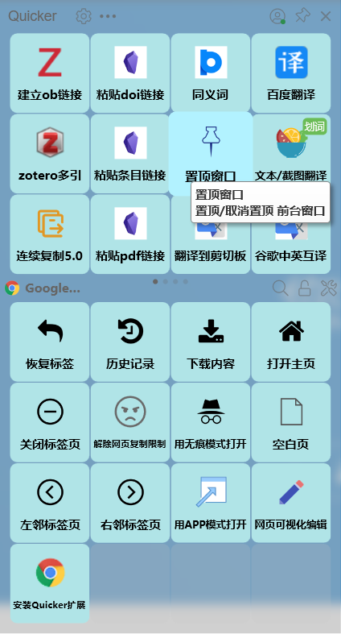
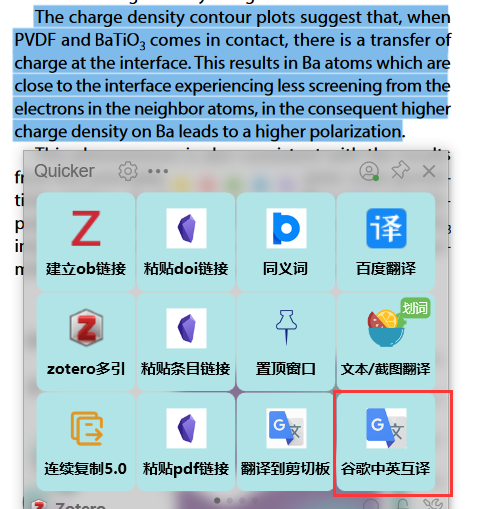

## zotero beta 划词翻译

zotero划词翻译依赖的是第三方软件实现的，不是通过内部插件

如果觉得`quicker`很好用，开会员的话使用我的推荐码`507828-9161`，双方都可以多得90天。

### 1. 下载[quicker](https://getquicker.net/)并安装

得到如下页面。quicker是一个平台，所有的功能都依赖上面的动作实现，该动作可以自己开发也可以使用别人的动作。

## 2. 下载翻译动作

点击动作库

翻译

你可以在这里面挑选自己喜欢的翻译。

我用的是下面的这两个翻译

https://getquicker.net/Sharedaction?code=b0d1a134-8284-4a44-d1be-08d746da5869

https://getquicker.net/Sharedaction?code=37cbaf13-fa5b-4ac9-d828-08d88c21d1b3

其中沙拉查词需要自己根据作者文档配置一下浏览器

复制上面的链接，弹出`quicker`，右键点击一个空格，粘贴分享的动作。

## 3.翻译动作的使用

所有的功能如果你放在全局区，任何场景都可以使用。

### 3.1 谷歌翻译的使用

#### 3.1.1 选中你要翻译的内容

#### 3.1.2弹出quicker

点击谷歌翻译

即可弹出翻译的窗口

### 3.2 沙拉查词翻译

沙拉查词的使用和谷歌翻译有点有点区别

#### 3.2.1 弹出沙拉查词

#### 3.2.2 选中文本

就会自动弹出翻译框。

该动作功能比谷歌翻译多，使用起来相对复杂，需要摸索一段时间。