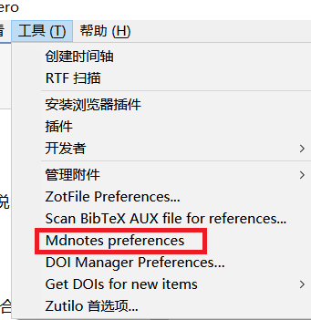
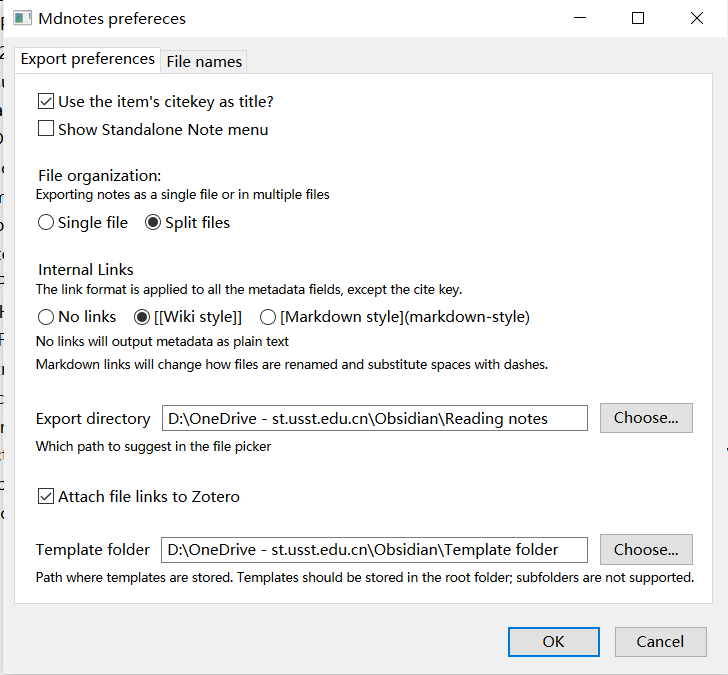
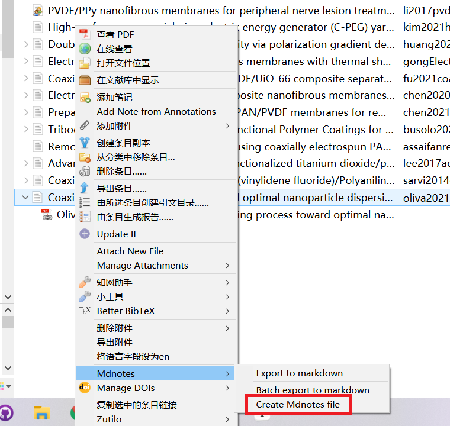
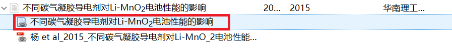

#### zotero和obsidian联动自动创建笔记模板

1. 安装`zotero插件\适配 Zotero 6.0 插件`里面的`mdnotes`插件

2. 安装Better bibtex插件

3. 安装[obsidian](https://obsidian.md)软件，选择obsidian保存数据的文件夹，在里面建立一个名为`Template folder`的文件夹，将[仓库](https://gitee.com/tughv/zotero-plug-in/tree/master)里面的`软件`文件夹里面的`Mdnotes Default Template.md`放到`Template folder`的文件夹里面去。

4. 设置zotero里面的mdnotes参数

   

Export directory为根据模板建立笔记的文件夹，Template folder为前面的模板文件夹

5. 使用时在条目上右键即会自动打开文件夹，保存即可。

配合[quicker动作](https://getquicker.net/Sharedaction?code=2616bdab-c1f5-4387-db43-08d9f27e1fa6)可以实现zotero里面点击红框里面的链接能自动跳转到obsidian的笔记。

