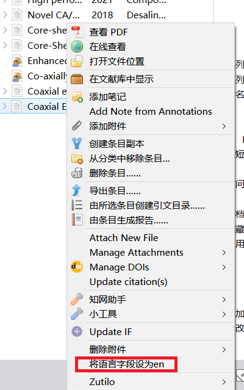
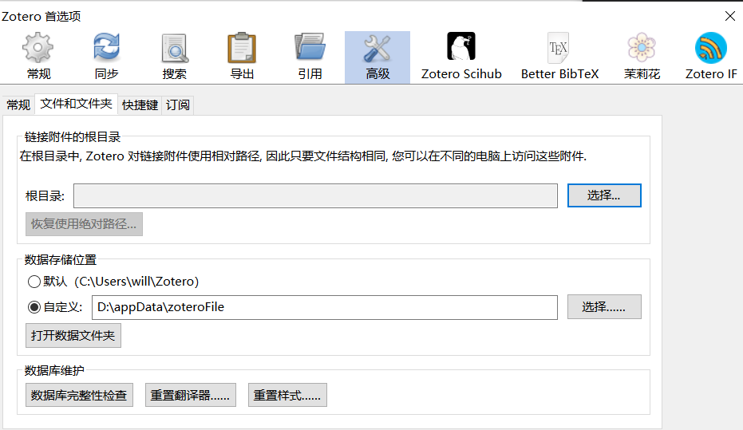

## 1. 安装批量改文献语言为en的插件

该插件解决的是中英文混排时，`等和et al`不能混合使用的问题，如果在引用时，英文文献的作者超过三个时，就会以`等`结尾，而不是`et al`，所以需要将`zotero`中的该文献语言改成`en`，该操作即可以手动完成，也可以使用下面的插件来完成。

插件的位置为`zotero插件->delitemwithatt.xpi`

右键点击选中的文献，将语言设置为en，即可批量改语言为en。

## 2. 选择中英文混排的`csl`

将该[网址](https://gitee.com/tughv/zotero-plug-in)文件夹`style`里面的的文件复制到zotero数据库的`style`文件夹里面，重启`zotero`

，即可在样式里面看到添加的引文格式，尝试使用一下这几个不同的格式就知道他们之间的区别了，其中`china-national-standard-gb-t-7714-2015-numeric-aulower-bilan-nodoi-modified1`是中英文混排时比较好用的格式。

- 查看zotero数据的位置

`编辑-首选项-高级-文件和文件夹-数据存储位置`

我的就在`D:\appData\zoteroFile`里面，如果你没有改数据库的位置，那就是`默认`显示的位置
