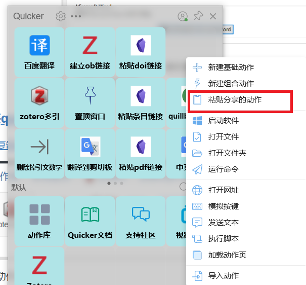

该快捷动作支持一次引用一片文献或多篇文献。

#### better BitTex配置

zotero需要安装better BitTex插件, quick-copy format 选择cite keys,

item format: better bibtex quick copy:cite keys

取消勾选 '使用添加引用的经典对话框'

#### 安装[quicker](https://getquicker.net/)

[动作复制网站](https://getquicker.net/Sharedaction?code=4a4a903b-be9d-490f-560d-08d9eec3922c&fromMyShare=true)

复制动作到剪切板

启动quicker,粘贴动作。

[可以实现的效果](https://files.getquicker.net/_actionDemos/4a4a903b-be9d-490f-560d-08d9eec3922c/20220214045652_yegvo-kuybx.mp4)

