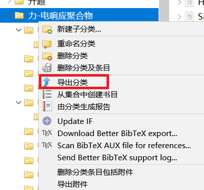

想要在写`latex`时引用`zotero`中的文献，而`zotero`中的文献更新时，latex的引文库也能同步更新

1. 安装`better bibTex`插件，该插件在`zotero插件`文件夹里面

   - 配置

   quick-copy format 选择cite keys,

2. 导出文献库，在需要引用的文件夹上面鼠标右键-导出分类

3. 选择格式为`Better BibLatex`, 选择keep upgraded，这样zotero里面的文献更新时，导出的.bib也会同步更新。选择要latex项目所在的文件夹，并给导出的.bib取一个名字。

   

使用的时候鼠标左键点中需要引用的文献，`ctrl shift C`这样就可以复制到citation key,该key和导出的bib文件慧保持一致，如果zotero里面的发生变化，导出的.bib文件也会同步更新。

如果导出的某个文件想要解除自动更新

在`编辑-首选项-Better BibTex  Automatic eport`里面吧那个文件`remove`掉