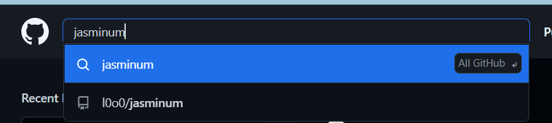
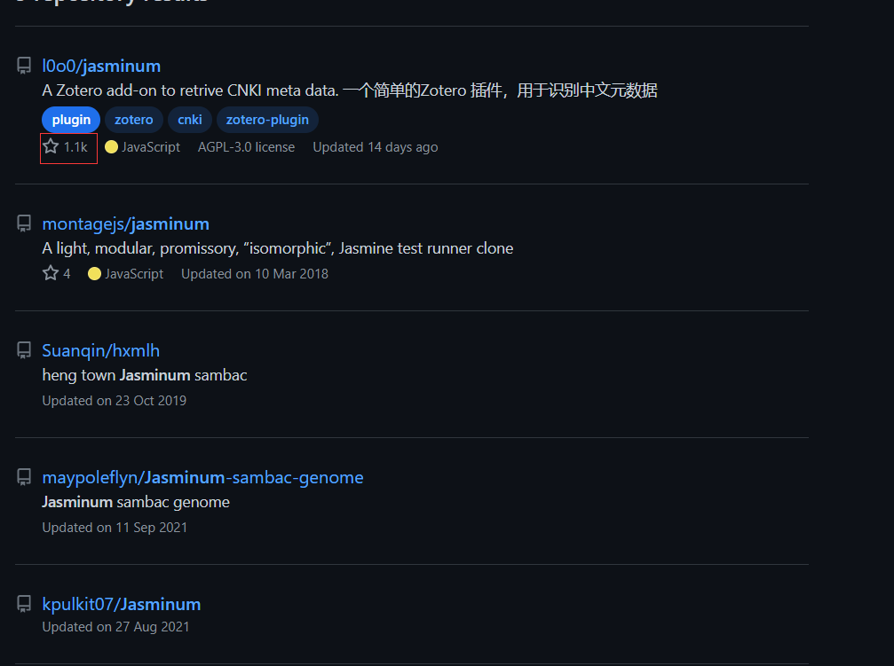
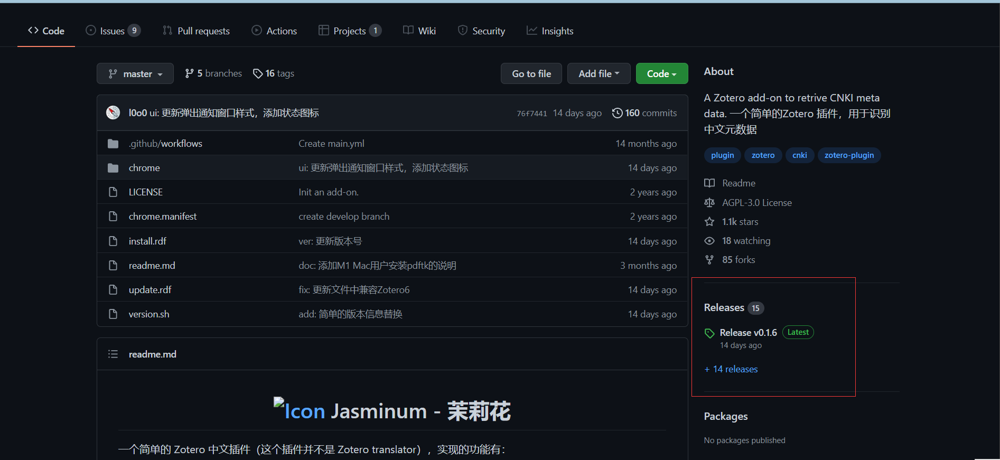
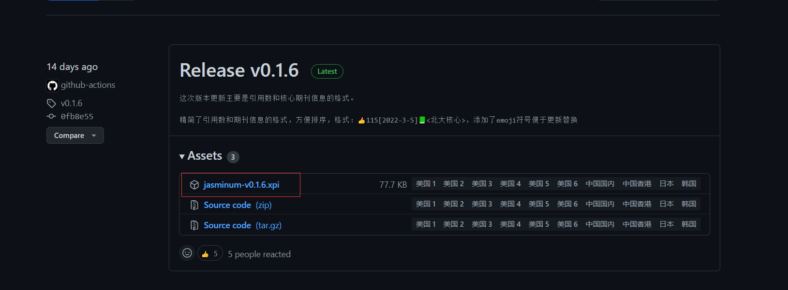

## 如何自己下载插件

一般来说，插件的作者会把自己的插件代码托管到[github]([GitHub](https://github.com/))，然后在左边的搜索框输入你想寻找的插件英文名，如我想查找茉莉花插件，就在搜索框里面输入`jasminum`

星星数量最多的那个就是插件的源仓库。

右边的release就是作者打包好的插件，点进去。

把`.xpi`下载下来即可，有些插件是`.zoteroplugin`，这是新版的插件格式，和`.xpi`一样使用。