[zotero使用教程1](https://www.bilibili.com/video/BV1eY41187ft?from=search&seid=16982179123616172064&spm_id_from=333.337.0.0)

[zotero使用教程2](https://www.bilibili.com/video/BV1ZE411p7qT/?spm_id_from=333.788.recommend_more_video.1)

## zotero的插件安装及功能教程

软件安装好会自动添加到word里面,如果没有安装word，去[上海理工大学信息化办公室](https://net.usst.edu.cn/)下载（注：只有连接上理校园网才能激活），里面有详细的安装和激活步骤，或者自己找破解版。

## 1. 软件安装及浏览器插件配置

- 使用浏览器去访问[zotero网站](https://www.zotero.org/)

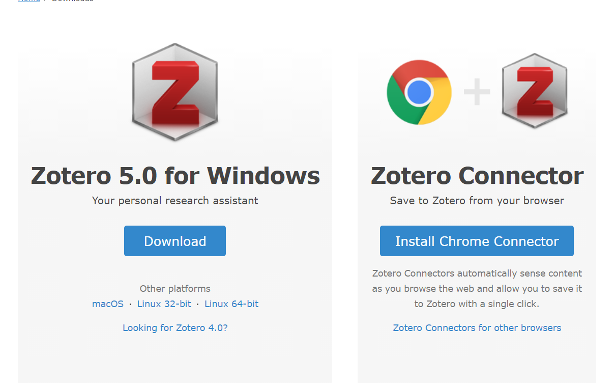

- 左边是软件的下载链接，下载软件的安装包，在pc安装即可。右边是插件下载快捷键，跟着完成即可。

- 对于谷歌浏览器，`zotero connector`无法连接到插件的商店，需要使用离线安装的办法将插件安装到浏览器里面，将离线插件`zotero connector`里面的`zotero-connector.crx`。谷歌浏览器的插件安装方法百度。

- 对于edge和firforx，点击**Install xxx connector**就会跳转到应用商店下载。

## 2. 坚果云盘同步（如果不需要多台电脑登录一个账号进行同步则无需此步骤）

==文档后面有使用onedrive同步的办法==

坚果云如果不开通会员每个月只有1g的上传流量

这里使用坚果云配置同步功能

1. 注册一个坚果云账号
2. 在账户信息右边的安全选项里面添加应用

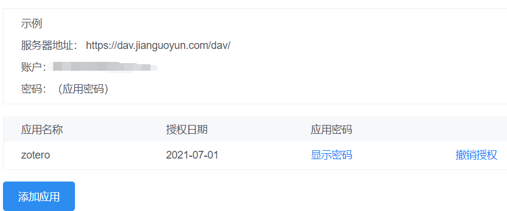

3. 注册一个zotero账号，登陆，如下勾选。

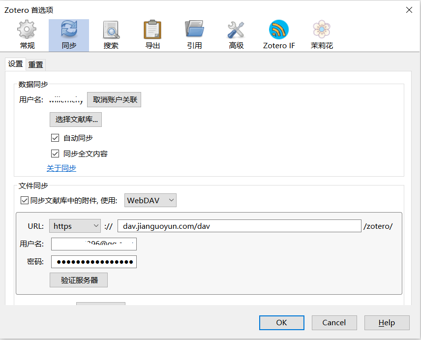

3. 在zotero软件 编辑-首选项里面登录zotero账号，在文件同步里面选择webDAV
4. 里面的密码是坚果云里面应用密码，账号为坚果云账号

## 3. zotero更改数据保存位置

因为zotero的数据和zotero的安装位置是分开的，而且数据默认的保存位置在c盘，对于c盘数据不够大的小伙伴应该希望能够更改数据保存位置。

`编辑-首选项-高级-文件和文件夹`

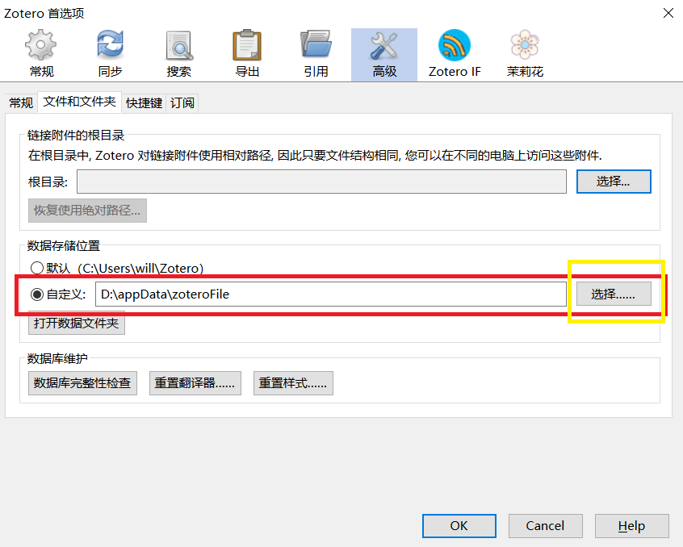

点击选择，软件重启，即可更在数据保存的位置。

## 4. word里面没有zotero选项解决办法

1. 如果word版本太老需要安装较新的版本
2. `编辑-首选项-引用-文字处理软件`

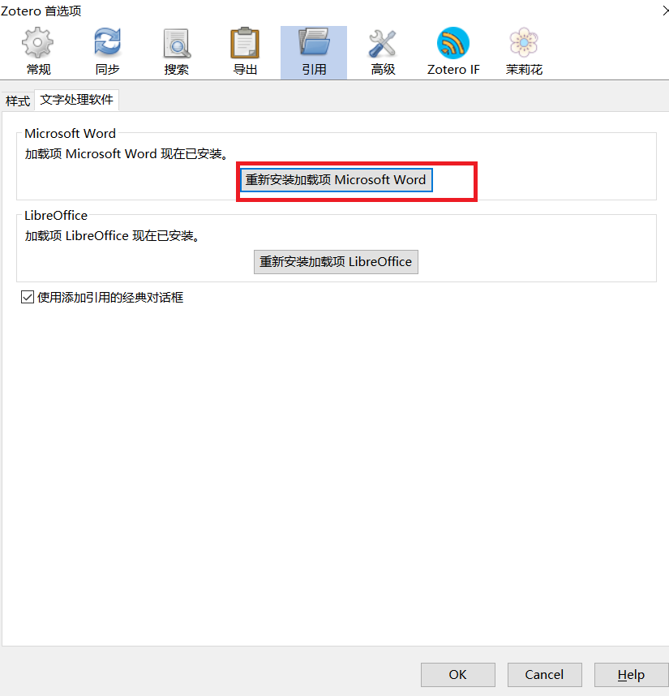

## 5. zotero配置scihub

[参考链接](https://www.52pojie.cn/forum.php?mod=viewthread&tid=1237319)

1. 编辑-首选项-高级-设置编辑器

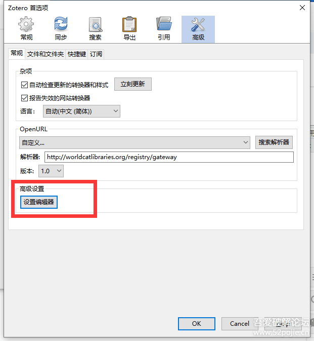

2. 搜索findPDF，双击搜索结果

   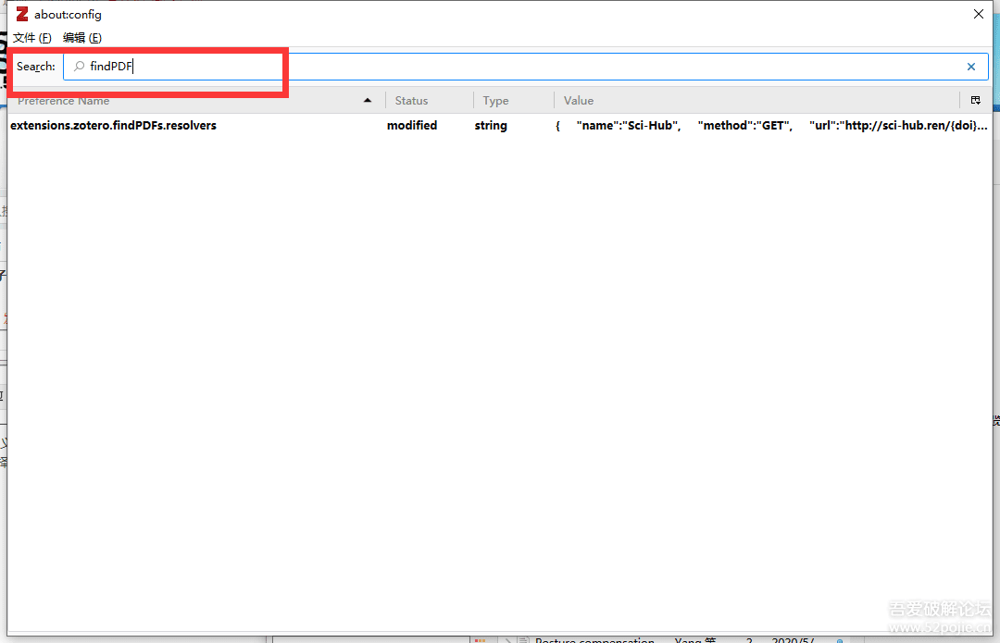

3. 双击后打开的对话框中输入，原本输入框里面会自带一个**==[]==**,将其删掉就行。
   `{   "name":"Sci-Hub",   "method":"GET",   "url":"http://sci-hub.ren/{doi}",   "mode":"html",   "selector":"#pdf",   "attribute":"src",   "automatic":true }`
   
4. 即可使用Sci-Hub作为源进行文献自动下载

   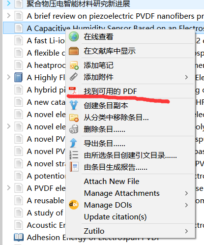

对于一些无法开放获取的文献，右键->找到可用的PDF，软件就会到scihub上查找并下载，如果失败，就需要自己去下载然后拖入对应的目录。

## 6. zotero配置quicklook

该软件的功能是在不打开文件的情况下快速预览，敲击空格键就可以预览内容，再敲击空格键就可关闭。

1. 需要先安装**quicklook.msi**的软件

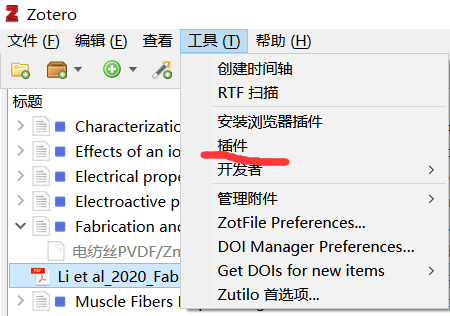

2. 在zotero里面安装插件

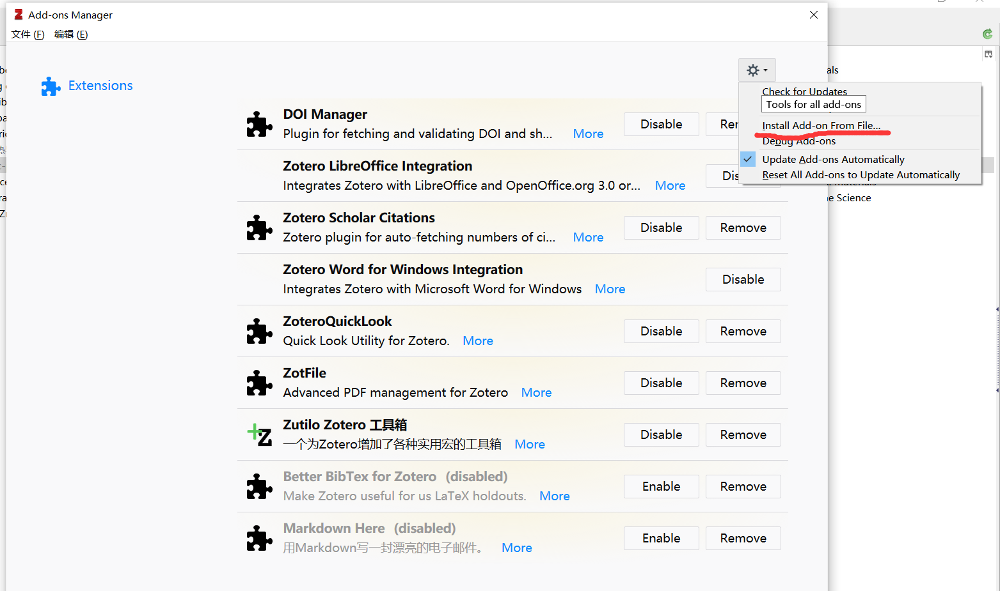

然后找到**quicklook**的插件文件，点击即可，该软件可以通过敲击**空格键**快速预览内容而不用打开文件，节省时间。

==zotero_beta版本的quicklook失效解决办法在`Zoteroquicklok_for_beta`文件夹里面==

## 7. zotfile插件的安装与quicklook插件的安装步骤完全一致

zotefile插件的作用是能够自动重命名pdf

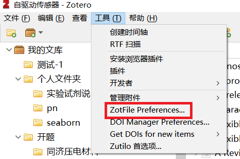

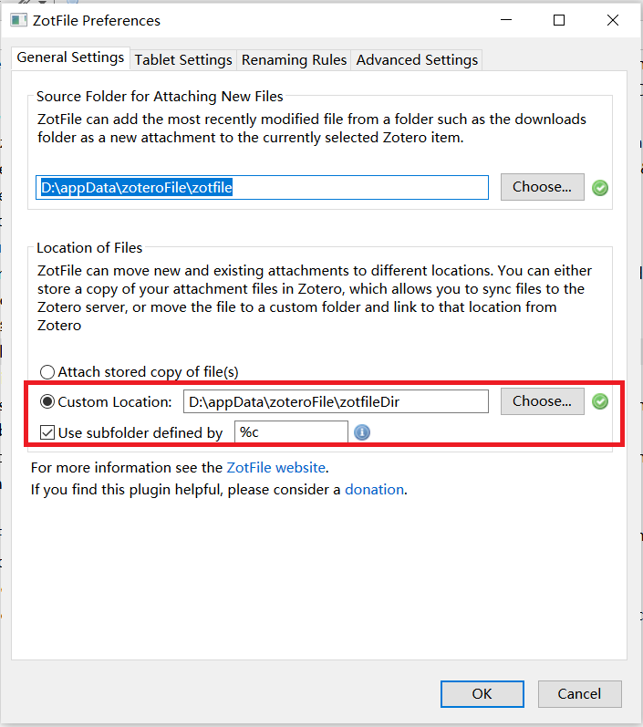

`custom location`可以选择一个文件夹按照zotero里面的目录结构保存pdf

use subfolder defined by 是重新保存pdf的规则。

## 8. zotero更改视图

编辑->首选项->引用文字处理软件，勾选**使用添加引用的经典对话框**

如果不勾选使用添加引用的静电对话框，在word里面引用文献的时候弹出的将是搜索框，可根据自己的喜好选择。

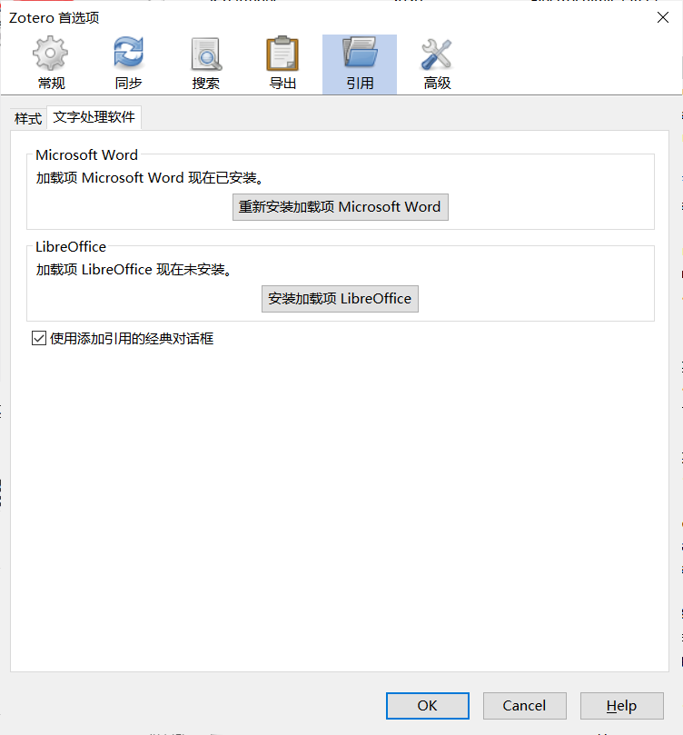

## 9. 安装批量改文献语言为en的插件

改插件解决的是中英文混排时，`等和et al`不能混合使用的问题，如果在引用时，英文文献的作者超过三个时，就会以`等`结尾，而不是`et al`，所以需要将`zotero`中的该文献语言改成`en`。

插件的位置为`zotero插件->delitemwithatt.xpi`

右键点击选中的文献，将语言设置为en，即可批量改语言为en。

## 10. 自动填充影响因子的插件

安装zotero IF.xpi插件，就可以在右键里面看到影响因子的功能，影响因子的位置在`版权`里面填充

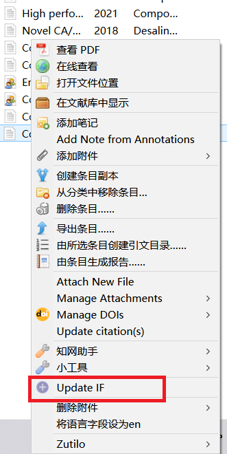

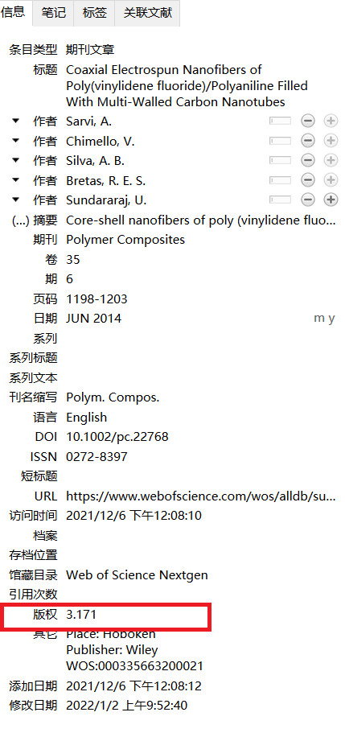

## 11. 选择中英文混排的`csl`

将该文件夹`style`里面的的文件复制到zotero数据库的`style`文件夹里面，重启`zotero`

，即可在样式里面看到添加的引文格式。

## 12. 笔记软件typora

- 安装文件夹里面的typora安装程序
- 运行mdRegrester.reg，这样就可以右键新建`markdown file`
- typora的使用教程[参考博客](https://blog.csdn.net/mus123/article/details/104294246)

## 13. 茉莉花插件

安装插件`jasminum-v0.1.2.xpi`，该插件是一个对中文文献起到功能增强的插件，当将知网下载的pdf拖到zotero里面，他能够帮你自动提取里面的关键信息并建立分类，能够将中文名合并。

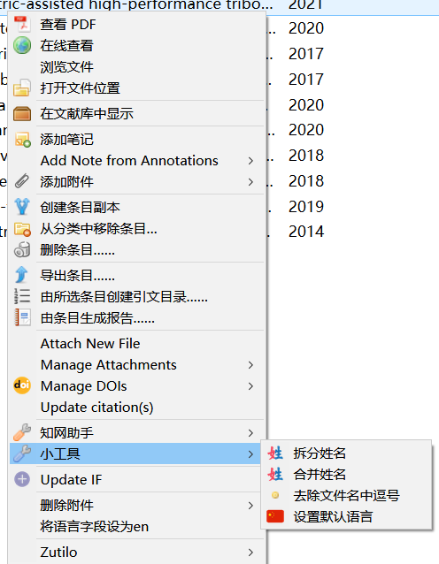

## 14. [提取word里面的所有引用文献的网站](https://rintze.zelle.me/ref-extractor/)

1. 点击选择文件，写人作文自己要提取的word，==注意：提交的word不能取消文献链接==

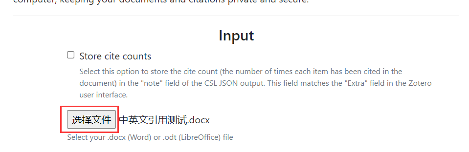

2.  选择要导出的引文格式

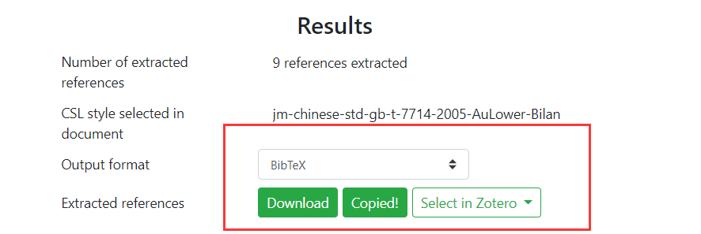

3. `Download`下载即可，然后在相关软件里面导入。

## 15 . zotero利用onedrive同步

1. 注册一个zotero账号，登陆，如下勾选。

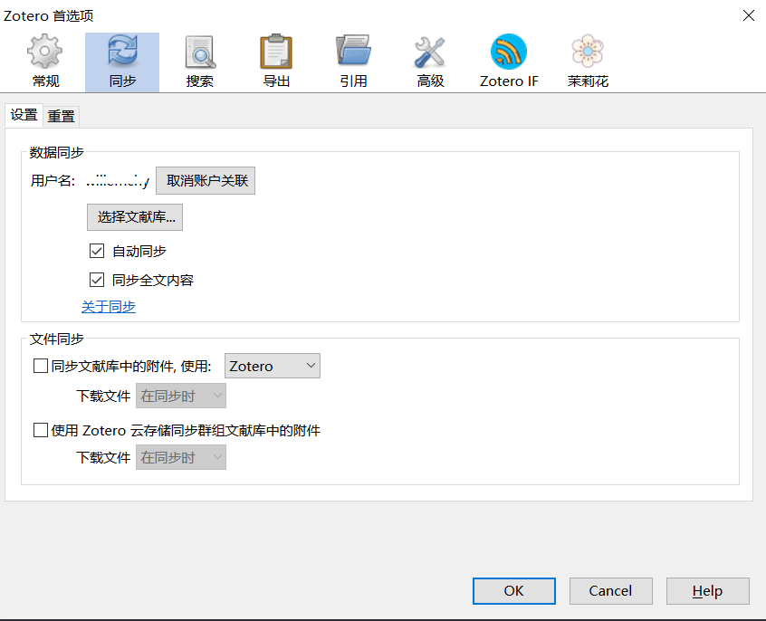

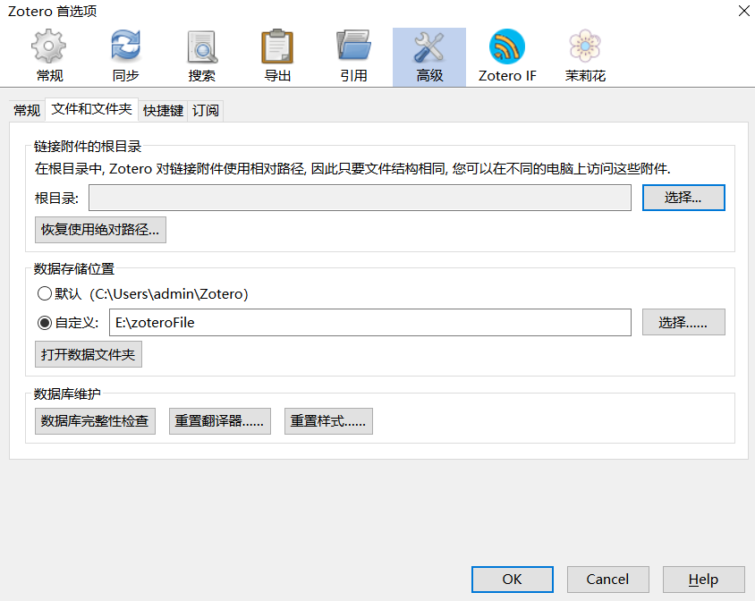

2. 将`E:\zoteroFile`下面的storage剪切到`onedrive`所在的文件夹

3. 用管理员身份打开`cmd`，使用命令`mklink /j  "软连接所在文件" "真正的文件所在的位置"`，即可将`zoteroFile`里面的storage指向`onedrive`里面的`storage`，`zoteroFile`里面只是一个链接文件，真正的文件在`onedrive`里面。软连接所在的文件夹就是在这里建立一个快捷链接，点击这个快捷链接就相当于到文件夹所在的真正位置而不用去打开文件的真正位置。

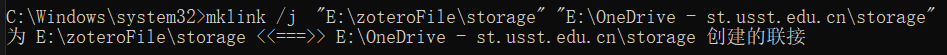

4. 如果使用了`zotfile`自定义了文件夹，那么只需要像上面那样将zotfile的文件夹剪切到云盘，再在本地建立软连接

5. 在另一台电脑上只需要将本地的这两个文件夹和云盘里面的文件夹建立软连接即可

==注==：两台电脑上的数据保存的盘符和路径最好保持一致，即自定义的数据存储路径在两台电脑上保持一致，这样使用`zotfile`自定义文件保存位置同步后不会出现找不到文件的问题。

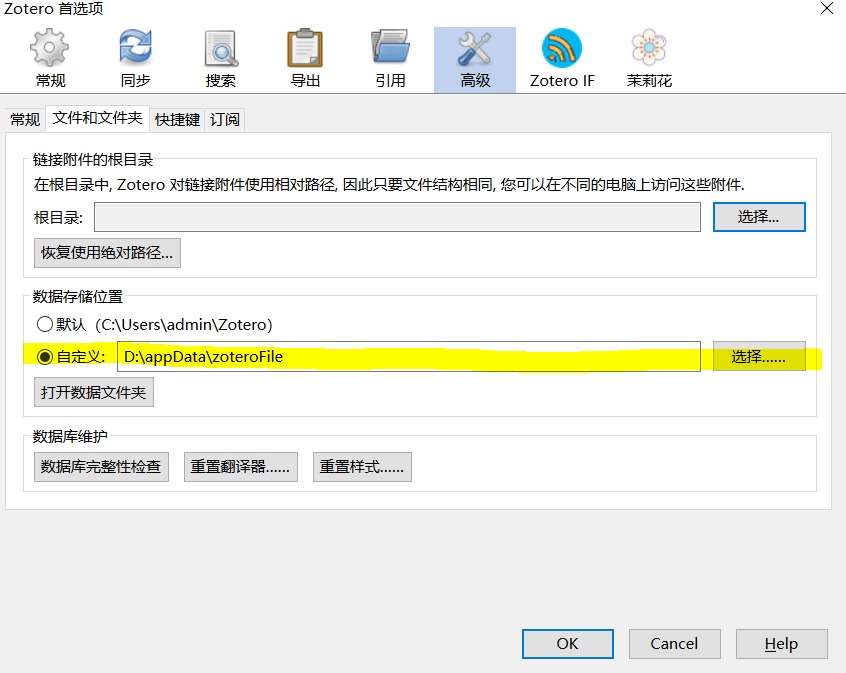

