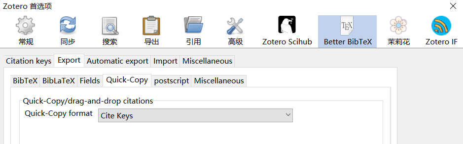
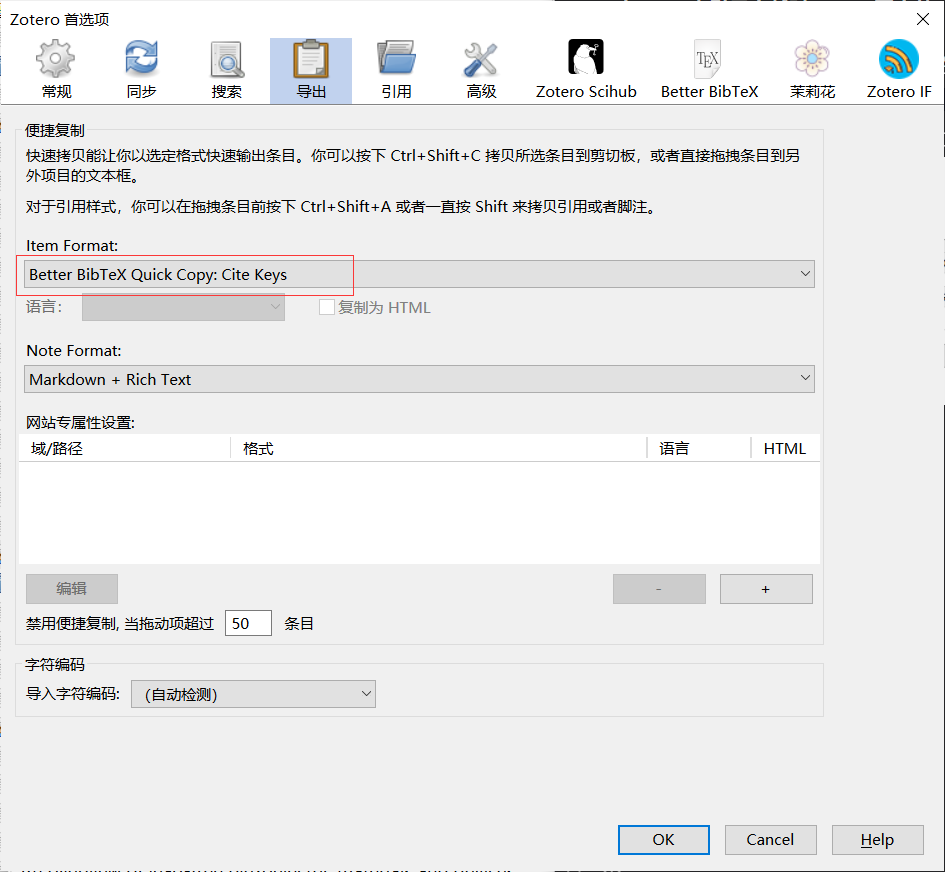
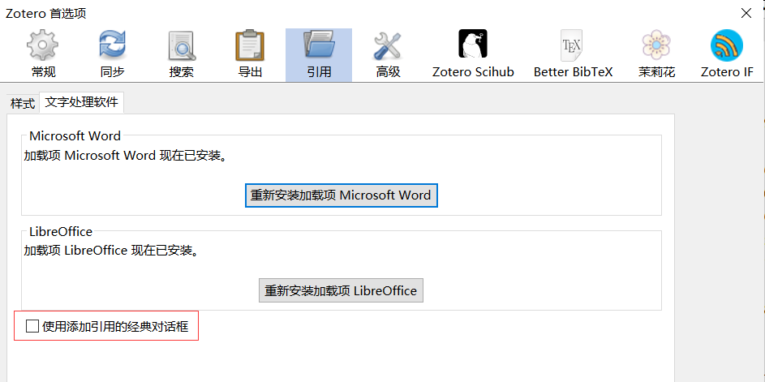

#### 在word中引用文献时zotero更高效

1. 安装better bibtex插件，该插件在`zotero插件\适配 Zotero 6.0 插件`文件夹里面，名为`zotero-better-bibtex-6.2.4.xpi`
2. zotero里面点击`编辑-首选项`，如下图所示。
3. 
4. 

设置完成

6. 左键点击你要引用的文献，`Ctrl shift C`，即可复制你要引用的文献的citation key, 到word中，将光标放到你要引用这篇文献的地方，点击word项目栏里面的`zotero-add/edit citation`，弹出搜索框，将刚才复制的东西粘贴进去，下面就会自动弹出该文献，点击一下`回车`，如果你需要继续在改地方引用文献，去zotero里面继续用`ctrl shift C`复制`citation key`，粘贴到搜索框里面，出现你要引用的文献，回车，如果需要继续引用，重复，如果引用完成，敲击回车。