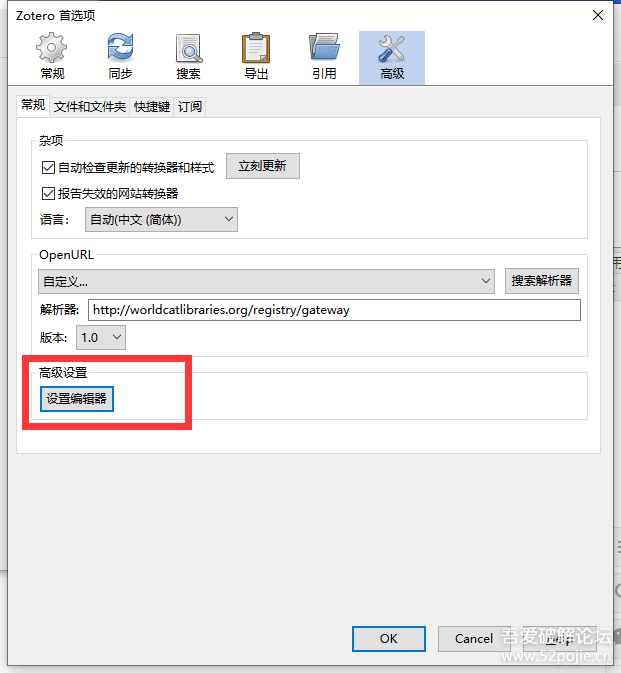
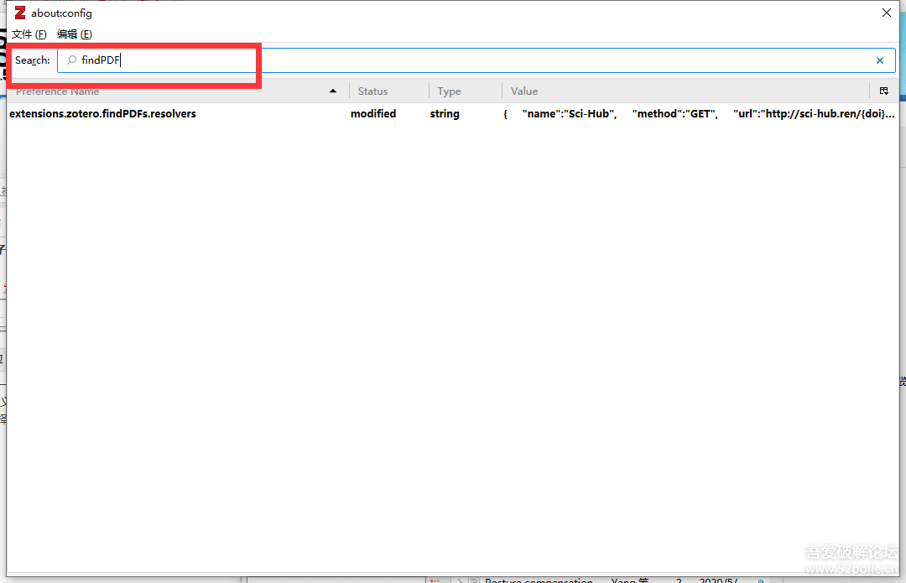
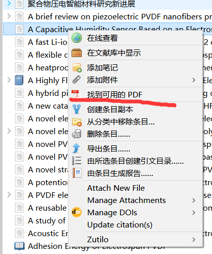
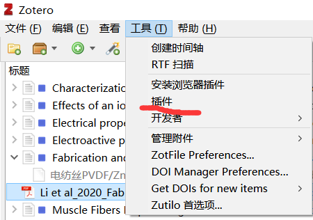
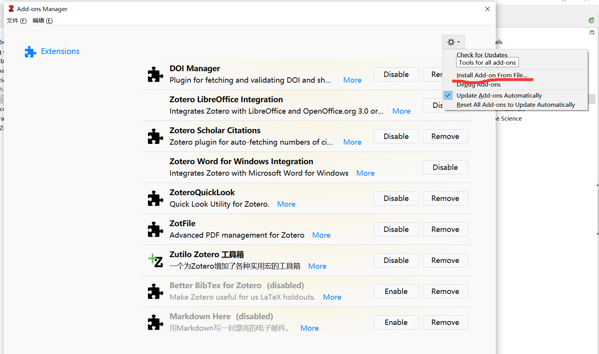
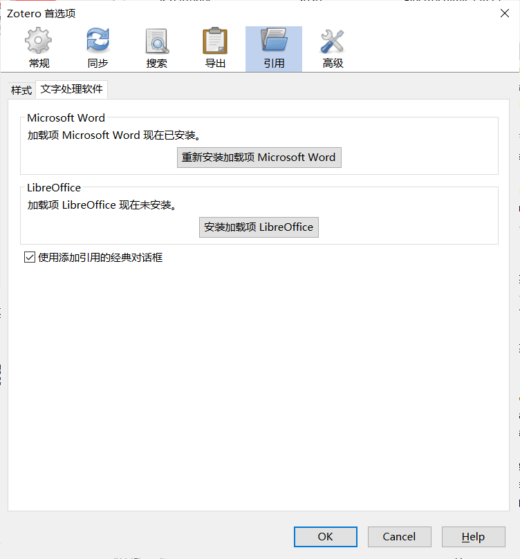
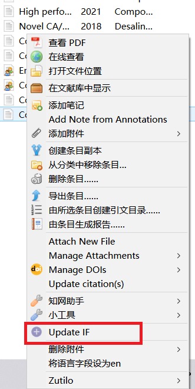
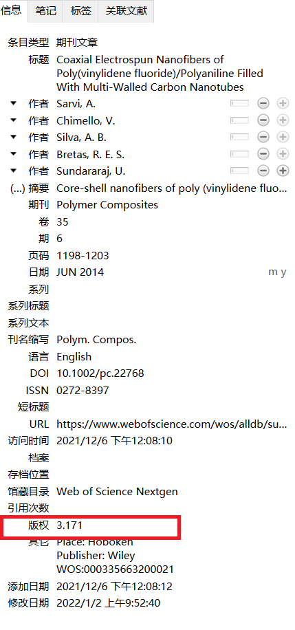

软件安装好会自动添加到word里面,如果没有安装word，去[上海理工大学信息化办公室](https://net.usst.edu.cn/)下载（注：只有连接上理校园网才能激活），里面有详细的安装和激活步骤，或者自己找破解版。

## 浏览器插件配置

- 使用浏览器去[zotero网站](https://www.zotero.org/)配置插件

左边是软件的下载链接，右边是插件下载快捷键，跟着完成即可。

对于谷歌浏览器，zotero connector无法连接到插件的商店，需要使用离线安装的办法将插件安装到浏览器里面，

对于edge和firforx，点击**Install xxx connector**就会跳转到应用商店下载。

## 云盘配置（如果不需要多台电脑登录一个账号无需此步骤）

这里使用坚果云配置同步功能

1. 注册一个坚果云账号
2. 在账户信息右边的安全选项里面添加应用

3. 注册一个zotero账号

4. 在zotero软件 编辑-首选项里面登录zotero账号，在文件同步里面选择webDAV

   

5. 里面的密码是坚果云里面应用密码，账号为坚果云账号

## zotero配置scihub

[参考链接](https://www.52pojie.cn/forum.php?mod=viewthread&tid=1237319)

1. 编辑-首选项-高级-设置编辑器

2. 搜索findPDF，双击搜索结果

   

3. 双击后打开的对话框中输入，原本输入框里面会自带一个**==[]==**,将其删掉就行。
   `{   "name":"Sci-Hub",   "method":"GET",   "url":"http://sci-hub.ren/{doi}",   "mode":"html",   "selector":"#pdf",   "attribute":"src",   "automatic":true }`
   即可使用Sci-Hub作为源进行文献自动下载
   
4. 

对于一些无法开放获取的文献，右键->找到可用的PDF，软件就会到scihub上查找并下载，如果失败，就需要自己去下载然后拖入对应的目录。

## zotero配置quicklook

该软件的功能是在不打开文件的情况下快速预览，敲击空格键就可以预览内容，再敲击空格键就可关闭。

需要先安装**quicklook.msi**的软件

#### 		在zotero里面安装插件

然后找到**quicklook**的插件文件，点击即可，该软件可以通过敲击**空格键**快速预览内容而不用打开文件，节省时间。

## zotfile插件的安装与quicklook插件的安装步骤完全一致

## zotero更改视图

编辑->首选项->引用文字处理软件，勾选**使用添加引用的经典对话框**

## 安装批量改文献语言为en的插件

改插件解决的是中英文混排时，`等和et al`不能混合使用的问题，如果在引用时，英文文献的作者超过三个时，就会以`等`结尾，而不是`et al`，所以需要将`zotero`中的该文献语言改成`en`。

插件的位置为`zotero插件->delitemwithatt.xpi`

右键点击选中的文献，将语言设置为en，即可批量改语言为en。

## 自动填充影响因子的插件

影响因子的位置在`版权`里面填充

