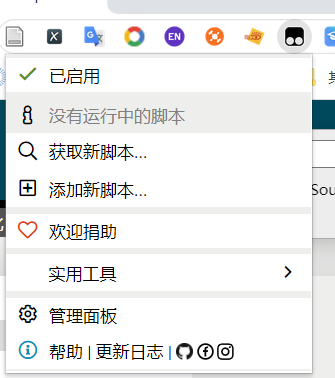
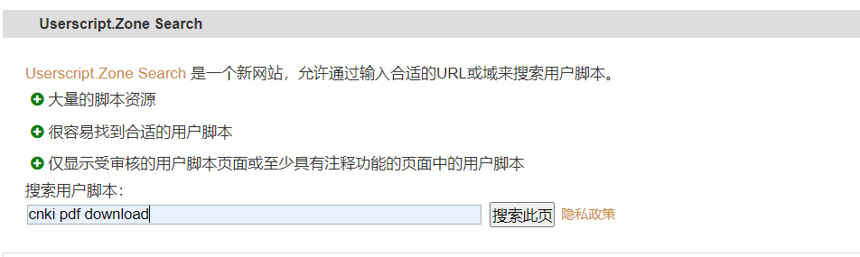
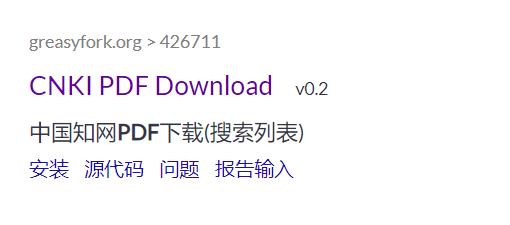
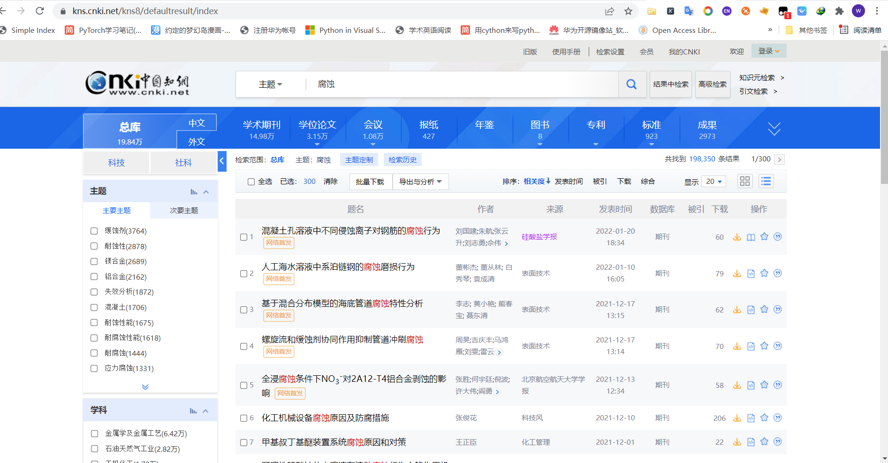

知网下载硕博论文pdf

1. 在浏览器里面安装油猴插件Tampermonkey

   ​	谷歌浏览器无法访问插件商店，使用火狐或者edge浏览器即可

2. 鼠标左键点击油猴插件

   

3. 点击获取新脚本

​		

在搜索框输入`cnki pdf download` 搜索

点击安装

然后在插件的管理面板里面可以看到已经安装好的插件

#### 插件使用教程

在访问知网的时候，插件会自动执行，然后可是看到下载按键旁边多了一个黄色的下载按键，点击即可下载该论文的pdf，而不是caj。

